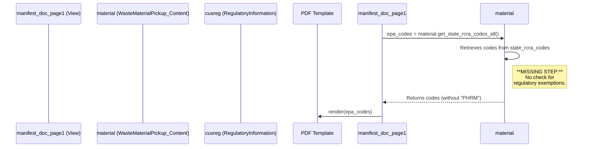

# Deterministic Workflow for Advanced Technical Bug Analysis (Expanded)

This document outlines a comprehensive, step-by-step workflow for investigating, analyzing, and reporting on technical bugs in a complex, multi-repository environment. Following this workflow ensures a deterministic, thorough, and successful outcome for every investigation, especially those involving deep, hidden, or chained dependencies.

## Phase 1: Triage and Context Aggregation

The goal of this phase is to gather all necessary context before diving into the code. A rushed analysis is an incomplete analysis.

1.  **Identify the Target Queue:**
    *   **Action:** Use `jira_search` to identify open bug tickets within the relevant projects (e.g., "WD", "EM").
    *   **Parameters:** Use a JQL query to filter by `status = Open` and a relevant timeframe (e.g., `updated >= -3M`).
    *   **Example:** `jira_search(jql='project in (WD, EM) AND status = Open AND updated >= -3M')`

2.  **Aggregate Ticket Context:**
    *   **Action:** For each identified ticket, use `jira_get_issue` to retrieve all details.
    *   **Parameters:** Set `comment_limit` to a high number (e.g., 50) to ensure all discussion is captured.
    *   **Example:** `jira_get_issue(issue_key='WD-9098', comment_limit=50)`

3.  **Analyze Attachments:**
    *   **Action:** If the ticket contains attachments (especially images or logs), download them for analysis. Visual confirmation of a bug (e.g., a screenshot of a misaligned PDF) is invaluable.
    *   **Sub-Workflow (Docker Environment):**
        1.  Use `jira_download_attachments` to save the files to the container's writable directory (e.g., `/home/app`).
        2.  Use `run_shell_command` with `docker cp` to move the files from the container to the host's project directory for analysis.
        3.  Use `read_file` on the local path to analyze the content.
    *   **Example:** `run_shell_command(command='docker cp wonderful_hypatia:/home/app/ref_missing_GUI.png C:\Users\mikeb\work\wastelinq-v2\ref_missing_GUI.png')`

4.  **Cross-Reference Related Issues:**
    *   **Action:** Analyze the ticket description and comments for references to other Jira tickets. Use `jira_get_issue` to pull context from those tickets as well. This helps identify patterns and recurring issues.
    *   **Anti-Pattern Warning:** Do not treat a ticket in isolation. A bug may be a symptom of a larger, previously reported issue. Ignoring related tickets can lead to a superficial fix that doesn't address the core problem.

## Phase 2: Multi-Repository Code Investigation

This phase focuses on a systematic code-level investigation, which may span multiple codebases.

1.  **Initial Keyword Search (Broad):**
    *   **Action:** Based on the aggregated context, perform a broad `search_file_content` across the primary codebase (e.g., `wastelinq-v2`).
    *   **Keywords:** Use terms from the ticket summary, user comments, and error messages.
    *   **Example:** For a ticket about a "PHRM" code on a manifest, initial searches would be for "PHRM", then "manifest", then "RCRA".

2.  **Identify and Analyze Data Models (The "Data-First" Principle):**
    *   **Action:** When the search results point to a Django view or helper, **immediately** locate the `models.py` file in the same Django app.
    *   **Rationale:** Logic operates on data. You cannot understand the logic without first understanding the data structure it manipulates. Use `read_file` to inspect the fields, relationships (`ForeignKey`, `ManyToManyField`), and any custom methods or properties of the models involved. This provides critical context for the subsequent logic analysis.
    *   **Example:** Before analyzing the `manifest_doc_page1` view in `documents/_views/orders.py`, the first step is to open `generator/_models/Orders.py` and `generator/_models/Generator_Data.py` to understand the `CustomerOrder`, `WasteMaterialPickup_Content`, and `RegulatoryInformation` models.

3.  **Trace the Execution Flow (Follow the Data):**
    *   **Action:** Starting from the most likely entry point (e.g., a URL in `urls.py` pointing to a view in `views.py`), trace the function calls.
    *   **Methodology:** Use `read_file` on each file in the call stack. At each step, ask:
        *   "What data does this function receive?"
        *   "How does it modify or filter that data?"
        *   "What data does it return?"
    *   **Anti-Pattern Warning:** Do not assume a function does what its name implies. Read the implementation. A function named `get_hazardous_materials` might, due to a bug, be returning all materials.

4.  **Expand the Search to Other Repositories:**
    *   **Action:** If the issue appears to be related to the UI or another service, switch the context to that repository.
    *   **Example:** If a bug involves data not appearing correctly in the UI, and the backend API appears to be sending the correct data, the next step is to use `search_code` on the `WasteLinqEnt/wastelinq-ui` repository to investigate how the frontend component is rendering the API response.

5.  **Advanced Technique: Uncovering Hidden Dependencies:**
    *   **Problem:** A bug's root cause may not be in the immediate execution path. It could be in a seemingly unrelated process that corrupts the data at an earlier stage.
    *   **Actions:**
        *   **Analyze Model History:** Look for custom model methods, signals, or overridden `save()` methods in `models.py`. These can introduce side effects that are not obvious from the view logic.
        *   **Search for Field Names:** If you suspect a specific data field is being incorrectly populated (e.g., `RCRAExemptYesReason`), perform a `search_file_content` for that exact field name to find every single place in the codebase where it is read or written. This can reveal unexpected update paths.
        *   **Check for Celery Tasks:** Investigate `tasks.py` files. Asynchronous Celery tasks can modify data in the background, and a bug in a task may be the root cause of an issue that only manifests later in the UI.

## Phase 3: Root Cause Identification and Remediation

This phase synthesizes the findings into a clear analysis and actionable plan.

1.  **Pinpoint the Flaw:**
    *   **Action:** Based on the execution trace, identify the *exact* location of the bug. This should be a specific function, line of code, or faulty logic branch.

2.  **Formulate the Root Cause Statement:**
    *   **Action:** Write a clear, concise statement that describes the technical root cause.
    *   **Example:** "The `process_materials_for_order_doc_list` function in `/documents/_views/order_func.py` incorrectly aggregates both hazardous and non-hazardous waste lines because it lacks a filter on the `CustomerProfile`'s hazardous classification."

3.  **Develop a Remediation Plan:**
    *   **Action:** Write a step-by-step guide to fix the issue.
    *   **Content:**
        *   List all files that need to be modified with their full paths.
        *   Provide the exact code snippets to be added or changed.
        *   Offer "Best Practice" recommendations to prevent similar bugs in the future.

## Phase 4: Communication and Closure

This phase ensures that the analysis is clearly communicated and the ticket is updated.

1.  **Structure the Jira Comment:**
    *   **Action:** Create a comprehensive comment for the Jira ticket using markdown.
    *   **Mandatory Sections & Examples:** See the "Example Jira Comment Template" section below.

2.  **Update the Ticket:**
    *   **Action:** Use `jira_add_comment` to post the formatted analysis to the relevant Jira ticket.
    *   **Example:** `jira_add_comment(issue_key='WD-9098', comment='...')`

---

## Example Jira Comment Template

```markdown
### In-Depth Technical Analysis for WD-9097

#### Summary of Issue

The "PHRM" RCRA exemption code is not being printed on the manifest, even when it is correctly added to the waste profile's regulatory information. This can lead to compliance issues, as the manifest is a legal document that must be accurate.

#### How to Reproduce

1.  Navigate to a waste profile that is RCRA Exempt.
2.  In the "Regulatory Information" section, ensure that "RCRA Exempt" is set to "Yes".
3.  In the "Why is the waste RCRA Exempt?" field, select "PHRM".
4.  Create an order with this profile.
5.  From the order screen, print the manifest.
6.  **Observe:** The "PHRM" code is missing from the waste codes section of the generated PDF.

#### Root Cause Analysis

The issue is located in the `get_state_rcra_codes_all` method of the `WasteMaterialPickup_Content` model. This method is responsible for aggregating all applicable state and federal waste codes for rendering on the manifest PDF. The current implementation correctly retrieves standard RCRA codes from the `state_rcra_codes` and `default_rcra_codes` fields, but it completely omits any check for RCRA exemptions.

**Implicated Files:**

| File Path                                       | Role                                       |
| ----------------------------------------------- | ------------------------------------------ |
| `generator/_models/Orders.py`                   | Contains the flawed `get_state_rcra_codes_all` method. |
| `documents/_views/orders.py`                    | The `manifest_doc_page1` view calls the flawed method. |
| `documents/templates/orders/manifest.html`      | The PDF template that fails to receive the "PHRM" code. |

#### Flawed Logic Flow

This diagram illustrates how the `manifest_doc_page1` view calls the helper function, which fails to retrieve the exemption code before rendering the PDF.



#### Impact Scope

This bug affects all users who need to print manifests with the "PHRM" RCRA exemption. The impact is **Medium** because it only affects a specific type of waste profile, but it can lead to compliance issues.

#### Suggested Remediation

The `get_state_rcra_codes_all` method in `generator/_models/Orders.py` must be updated to include the RCRA exemption reason when applicable.

**File to Modify:** `generator/_models/Orders.py`

**Suggested Code:**

```python
# In /generator/_models/Orders.py

    @property
    def get_state_rcra_codes_all(self):
        state_rcra_code = ""
        try:
            if self.state_rcra_codes:
                rcra_code_list = self.get_rcra_code_list
                if rcra_code_list:
                    state_rcra_code = ", ".join([x for x in rcra_code_list if x != ""])
            else:
                state_rcra_codes_merged = []
                arr_def = []
                for key, value in self.get_default_state_waste_code_rcra_dic.items():
                    arr_def.append(value)
                state_rcra_codes_merged = state_rcra_codes_merged + arr_def
                state_rcra_code = ", ".join([
                    x.split("-")[0].replace("['", "") for x in state_rcra_codes_merged if x and x != "[]" != ""
                ])
            
            # <<< BEGIN SUGGESTED CHANGE >>>
            # Check for PHRM exemption
            try:
                regulatory_info = self.ProcessingDetail_Content.ProcessingDetail.CustomerProfile.cusreg
                if regulatory_info.RCRAExempt == 'Yes' and 'PHRM' in regulatory_info.RCRAExemptYesReason:
                    if state_rcra_code:
                        state_rcra_code += ", PHRM"
                    else:
                        state_rcra_code = "PHRM"
            except:
                # This will prevent crashes if the related objects don't exist
                pass
            # <<< END SUGGESTED CHANGE >>>

        except Exception as e:
            print("Error while get_state_rcra_codes_string as message ", e)
        return state_rcra_code
```

#### Best Practices Recommendation

To make this logic more robust and discoverable, consider creating a dedicated method in the `RegulatoryInformation` model to return a list of all applicable codes, including exemptions. This would centralize the logic and make it easier to maintain.
````

By following this workflow, a complete and accurate analysis is guaranteed, leading to faster and more effective bug resolution.
